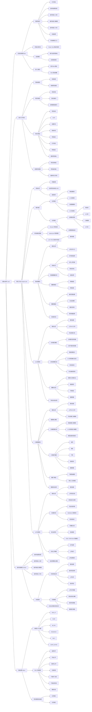

# Web 网站页面结构设计

## 1. 页面结构树

```mermaid
flowchart LR
    Root[前端UI组件 vue3]

    Root --> App[全局应用框架 App]
    Root --> Home[首页 打开项目]
    Root --> Workspace[项目工作台 /project/:uuid]
    Root --> Temp[临时快速模式 /temp/*]
    Root --> About[后端设置 /about]

    App --> AppNav[顶部导航栏]
    App --> AppMain[页面主体区域]
    App --> AppModal[全局弹窗]
    App --> AppMode[双入口模式]
    AppNav --> AppNav1[打开项目]
    AppNav --> AppNav2[临时快速预处理]
    AppNav --> AppNav3[临时快速 Ai 分析]
    AppNav --> AppNav4[临时快速三维重建]
    AppNav --> AppNav5[临时快速 Ai 问诊]
    AppNav --> AppNav6[后端设置]
    AppNav --> AppNav7[开发者模式入口]
    AppMain --> AppMain1[Router View 路由内容区]
    AppModal --> AppModal1[离开当前项目确认]
    AppModal --> AppModal2[全局错误提示]
    AppMode --> AppMode1[标准 Web 路由]
    AppMode --> AppMode2[Client 路由镜像]

    Home --> HomeHead[页面标题区]
    Home --> HomeList[项目列表区]
    Home --> HomeDetail[项目详情区]
    Home --> HomeCreate[新建项目弹窗]
    HomeHead --> HomeHead1[系统标题]
    HomeHead --> HomeHead2[新建项目按钮]
    HomeList --> HomeList1[项目列表]
    HomeList --> HomeList2[空状态提示]
    HomeList --> HomeList3[服务器离线提示]
    HomeDetail --> HomeDetail1[项目名称]
    HomeDetail --> HomeDetail2[UUID]
    HomeDetail --> HomeDetail3[创建时间]
    HomeDetail --> HomeDetail4[修改时间]
    HomeDetail --> HomeDetail5[项目备注]
    HomeDetail --> HomeDetail6[打开项目]
    HomeDetail --> HomeDetail7[修改备注]
    HomeDetail --> HomeDetail8[删除项目确认]
    HomeCreate --> HomeCreate1[项目名称输入]
    HomeCreate --> HomeCreate2[项目备注输入]
    HomeCreate --> HomeCreate3[创建并进入项目]

    Workspace --> WorkHead[页面头部]
    Workspace --> WorkMode[展示模式]
    Workspace --> WorkDev[开发者模式弹窗]
    WorkHead --> WorkHead1[页面标题]
    WorkHead --> WorkHead2[当前项目名称或 UUID]
    WorkHead --> WorkHead3[返回首页]
    WorkMode --> WorkMode1[合并模式]
    WorkMode --> WorkMode2[分栏模式]
    WorkMode1 --> WorkMode1A[预处理模块]
    WorkMode1 --> WorkMode1B[Ai 分析模块]
    WorkMode1 --> WorkMode1C[三维重建模块]
    WorkMode1 --> WorkMode1D[Ai 问诊模块]
    WorkMode2 --> WorkMode2A[左侧模块导航]
    WorkMode2 --> WorkMode2B[右侧模块舞台区]
    WorkMode2A --> WorkMode2A1[预处理]
    WorkMode2A --> WorkMode2A2[Ai 分析]
    WorkMode2A --> WorkMode2A3[三维重建]
    WorkMode2A --> WorkMode2A4[Ai 问诊]
    WorkDev --> WorkDev1[info.json 项目信息]
    WorkDev --> WorkDev2[project.json 项目配置]
    WorkDev --> WorkDev3[LLM / RAG 调试命中信息]

    Workspace --> Preprocess[预处理模块]
    Workspace --> Analysis[Ai 分析模块]
    Workspace --> Reconstruction[三维重建模块]
    Workspace --> Consult[Ai 问诊模块]

    Preprocess --> Pre1[模块头部]
    Preprocess --> Pre2[初始化区]
    Preprocess --> Pre3[原始图像展示区]
    Preprocess --> Pre4[图像转换区]
    Preprocess --> Pre5[图像增强区]
    Preprocess --> Pre6[状态提示区]
    Pre1 --> Pre1A[模块标题]
    Pre1 --> Pre1B[上传文件入口]
    Pre2 --> Pre2A[文件类型选择]
    Pre2 --> Pre2B[文件上传列表]
    Pre2 --> Pre2C[初始化确认]
    Pre2 --> Pre2D[进度反馈]
    Pre4 --> Pre4A[转换按钮]
    Pre4 --> Pre4B[转换进度]
    Pre5 --> Pre5A[裁切范围设置]
    Pre5 --> Pre5B[对比度调整]
    Pre5 --> Pre5C[缩放与移动]
    Pre5 --> Pre5D[保存增强结果]

    Analysis --> Ana1[模块头部]
    Analysis --> Ana2[分析模式弹窗]
    Analysis --> Ana3[分析结果展示区]
    Analysis --> Ana4[图像对比区]
    Analysis --> Ana5[下载与状态反馈]
    Ana1 --> Ana1A[模块标题]
    Ana1 --> Ana1B[上传 NPZ 文件]
    Ana1 --> Ana1C[开始 重新分析]
    Ana2 --> Ana2A[分析裁切后的影像]
    Ana2 --> Ana2B[分析不裁切的影像]
    Ana3 --> Ana3A[原始影像显示]
    Ana3 --> Ana3B[Ai 分析影像标注显示]
    Ana3 --> Ana3C[空状态提示]
    Ana3 --> Ana3D[半自动裁切提示]
    Ana4 --> Ana4A[原图与分析图对比]
    Ana4 --> Ana4B[缩放锁定]
    Ana4 --> Ana4C[平移锁定]
    Ana4 --> Ana4D[重置视图]

    Reconstruction --> Rec1[模块头部]
    Reconstruction --> Rec2[重建确认弹窗]
    Reconstruction --> Rec3[三维模型展示区]
    Reconstruction --> Rec4[三维操作面板]
    Reconstruction --> Rec5[模型下载区]
    Reconstruction --> Rec6[重建状态反馈]
    Rec1 --> Rec1A[模块标题]
    Rec1 --> Rec1B[上传 NPZ 文件]
    Rec1 --> Rec1C[开始 重新三维重建]
    Rec3 --> Rec3A[原始影像三维模型]
    Rec3 --> Rec3B[Ai 分析影像三维模型]
    Rec3 --> Rec3C[模型加载失败提示]
    Rec4 --> Rec4A[旋转]
    Rec4 --> Rec4B[缩放]
    Rec4 --> Rec4C[平移]
    Rec4 --> Rec4D[视角同步]
    Rec4 --> Rec4E[重置视图]
    Rec5 --> Rec5A[下载原始模型]
    Rec5 --> Rec5B[下载 Ai 分析模型]

    Consult --> Con1[模块头部]
    Consult --> Con2[对话展示区]
    Consult --> Con3[输入操作区]
    Consult --> Con4[文档上传弹窗]
    Consult --> Con5[会话清理确认弹窗]
    Con1 --> Con1A[模块标题]
    Con1 --> Con1B[上传项目文档]
    Con1 --> Con1C[项目级问诊说明]
    Con2 --> Con2A[历史消息列表]
    Con2 --> Con2B[Markdown 渲染回复]
    Con2 --> Con2C[空状态提示]
    Con3 --> Con3A[问题输入框]
    Con3 --> Con3B[发送按钮]
    Con3 --> Con3C[Enter / Shift+Enter 快捷输入]
    Con4 --> Con4A[文件选择]
    Con4 --> Con4B[上传执行]
    Con4 --> Con4C[上传结果提示]

    Temp --> Temp1[临时快速预处理]
    Temp --> Temp2[临时快速 Ai 分析]
    Temp --> Temp3[临时快速三维重建]
    Temp --> Temp4[临时快速 Ai 问诊]
    Temp --> TempCommon[共用结构]
    TempCommon --> TempHead[共用页面头部]
    TempCommon --> TempModal[共用弹窗]
    TempCommon --> TempReuse[对应业务模块内容复用]
    TempHead --> TempHead1[模块标题]
    TempHead --> TempHead2[临时项目说明]
    TempHead --> TempHead3[上传文件]
    TempHead --> TempHead4[保存项目]
    TempModal --> TempModal1[上传文件弹窗]
    TempModal --> TempModal2[初始化确认弹窗]
    TempModal --> TempModal3[保存项目弹窗]
    TempModal --> TempModal4[通知提示弹窗]

    About --> About1[大模型 API 设置]
    About --> About2[RAG 文档管理]
    About --> About3[项目视图布局设置]
    About1 --> About1A[base_url]
    About1 --> About1B[model]
    About1 --> About1C[api_key]
    About1 --> About1D[temperature]
    About1 --> About1E[top_k]
    About1 --> About1F[system_prompt]
    About2 --> About2A[选择文件]
    About2 --> About2B[开始上传]
    About2 --> About2C[清空待上传]
    About2 --> About2D[文档列表]
    About2 --> About2E[下载单个文档]
    About2 --> About2F[下载全部文档]
    About2 --> About2G[删除文档]
    About3 --> About3A[合并模式]
    About3 --> About3B[分栏模式]
```